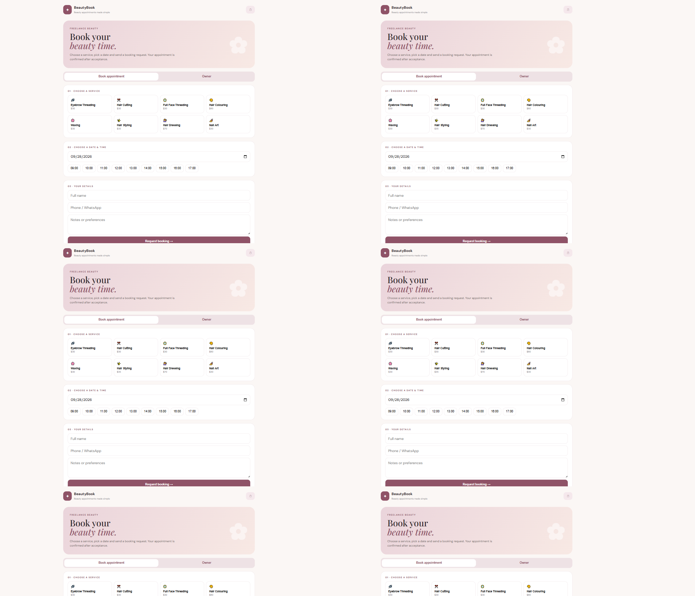
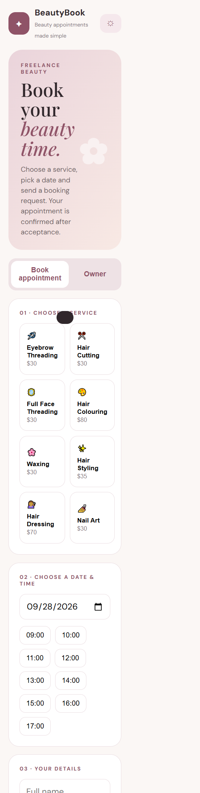
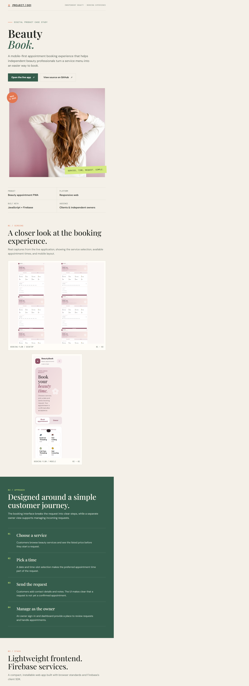
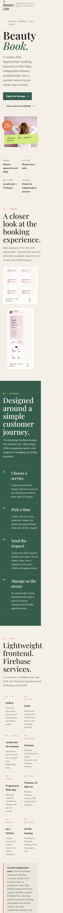

# BeautyBook

**A mobile-first appointment booking experience for independent beauty professionals.**

BeautyBook brings a beauty service menu, appointment-time selection, and booking requests together in one responsive web app. Customers can request an appointment, while the owner has a separate sign-in and request-management view.

| Project link | URL |
| --- | --- |
| Live application | [beautybook-87b3f.web.app](https://beautybook-87b3f.web.app/) |
| Source code | [GitHub repository](https://github.com/kisal-dv/BeautyBook-Firebase-PWA) |
| Project showcase page | [Open `PROJECT-SHOWCASE.html`](PROJECT-SHOWCASE.html) |
| Screenshots | [Open the `screenshots` folder](screenshots/) |

## Why BeautyBook

Independent beauty professionals often coordinate appointments through messages and calls. BeautyBook explores a clearer digital booking journey: customers can review services, choose a preferred date and time, and send their contact details and notes in one place. The owner can review requests separately from the customer booking screen.

The interface labels a submission as a **request**, not a confirmed appointment. An appointment becomes confirmed only after the owner accepts the request.

## How It Works

1. The app loads active services from the Firestore `services` collection and displays their names and prices.
2. A customer chooses a service, date, and available time, then enters a name, phone number, and optional notes.
3. The app checks for an existing confirmed appointment at that date and time, then creates a pending document in `bookingRequests`.
4. The owner signs in with Firebase Authentication and reviews incoming requests in the owner view.
5. The owner can accept a request, creating a confirmed document in `bookings` and updating the request status, or decline it.

## Technology

- **HTML5** provides the application structure and booking form.
- **CSS3** styles the responsive interface, service list, date and time selection, owner view, and theme.
- **JavaScript ES modules** power the interface and application logic without a frontend framework.
- **Firebase JavaScript SDK 12.1.0** is loaded as browser modules from Google's Firebase CDN.
- **Firebase Authentication** provides email-and-password sign-in for the owner view.
- **Cloud Firestore** stores services, booking requests, and confirmed bookings.
- **Firebase Hosting** serves the public application over HTTPS.
- **Web app manifest and service-worker file** are included in the project. The current app code does not register the service worker, so offline caching and complete PWA installation behavior still need implementation and testing.
- **Git and GitHub** track and publish the project source.

## Repository Guide

```text
index.html                 Main booking and owner interface
css/style.css              Responsive app styles
js/app.js                  Booking, owner, and Firebase logic
js/firebase-config.js      Firebase browser-app configuration
firebase.json              Firebase Hosting configuration
.firebaserc                Default Firebase project association
manifest.json              Web app metadata
service-worker.js          Service-worker cache implementation
PROJECT-SHOWCASE.html      Standalone visual project presentation
screenshots/               App and showcase screenshots
```

### What Are the Showcase Page and Screenshots?

`PROJECT-SHOWCASE.html` is a separate visual presentation of the project. It summarizes the product, customer workflow, implementation, technology stack, and links to the live app and source. It is not the booking application itself. Open it in a browser from the downloaded project folder to view the designed page.

The `screenshots/` directory contains image files, not another application or source-code folder. The `beautybook-` images show the live booking app at desktop and mobile sizes; the `project-showcase-` images show previews of the presentation page.

The README is the main project explanation and is rendered automatically on the GitHub repository page. The showcase HTML is an optional, more visual companion.

## Run Locally

1. Clone the repository:

   ```bash
   git clone https://github.com/kisal-dv/BeautyBook-Firebase-PWA.git
   cd BeautyBook-Firebase-PWA
   ```

2. Check that `js/firebase-config.js` points to the Firebase project you intend to use. The checked-in configuration currently points to `beautybook-87b3f`.
3. Serve the folder from a local web server. The app uses JavaScript modules and Firebase services, so opening `index.html` directly as a `file://` URL is not a supported run method.
4. Configure Firebase Authentication, Firestore, and secure Firestore rules for the selected project before testing data operations.

No Node package installation is required by the current frontend source.

## Deployment

The live application is hosted at [https://beautybook-87b3f.web.app/](https://beautybook-87b3f.web.app/). To deploy Hosting changes with the Firebase CLI, use an account authorized for the configured Firebase project and run:

```bash
firebase deploy --only hosting
```

The Hosting configuration serves the project folder. Review files and Firebase security rules before deploying changes.

## Security and Current Status

The Firebase configuration in `js/firebase-config.js` is browser-app configuration; values used by a browser app are visible to its users. It is not a place for passwords or private service-account credentials. Firestore Security Rules and Firebase Authentication must enforce access control. Never commit service-account JSON, private keys, passwords, or tokens.

The live interface has loaded service information, but a live check reported a Firestore permission error while reading confirmed bookings. Verify and test the rules for service reads, confirmed-booking reads, request creation, and owner-only request management before using the app for real customer appointments. Do not loosen rules to public unrestricted access as a workaround.

## Project Screenshots

### Live booking app





### Project presentation



